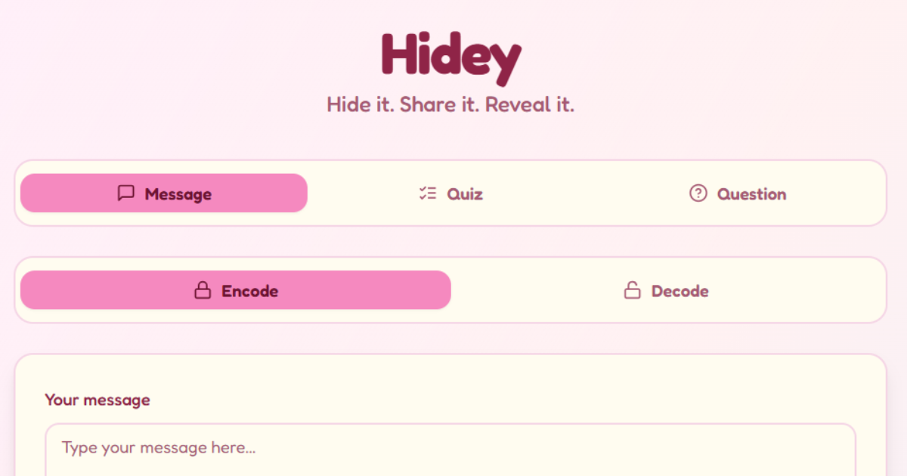

# 🔐 Hidey — Hide it. Share it. Reveal it.

> A free, private, browser-based secret message encoder, quiz maker, and question-lock tool. No account. No server. No data stored anywhere.

---

## About

Hidey is a completely client-side web app that lets you encode secret messages, create shareable quizzes, and lock content behind questions — all without any account, login, or server. Everything runs in your browser. Your data never leaves your device.

**Live at:** [tryhidey.xyz](https://tryhidey.xyz)

---

## Features

**🔐 Message Mode**

Encode any text using four patterns — Alnum Blocks, Symbol Stream, Caps Blast, Hex Weave. Add an optional passphrase for extra protection. Share via a formatted Share Card. Supports all languages and emoji up to 10,000 characters.

**🧩 Quiz Mode**

Create multiple choice quizzes up to 100 questions. Generate a compact HIDEYQ code to share. Recipients attempt the quiz and return a HIDEYS score code. Optional passphrase and Score Key protection.

**❓ Question Mode**

Lock a secret message behind a question. Only the correct answer reveals it. SHA-256 hashing verifies the answer. Challenge codes never expire.

**🌙 Dark Mode**

Full dark mode with system preference detection and localStorage persistence.

**📱 PWA**

Install on Android or iPhone home screen. Works offline after first load.

---

## Tech Stack

React 18 · TypeScript · Vite · Tailwind CSS · shadcn/ui · Radix UI · pako · Zod · React Router · Web Crypto API · qrcode.react · Lucide React · Sonner

---

## Security

- **100% Client-Side** — nothing ever sent to a server
- **SHA-256 Hashing** — via native Web Crypto API
- **Salted Hashing** — answer combined with question text prevents rainbow table attacks
- **Constant-Time Comparison** — prevents timing attacks
- **Zod Validation** — all decoded payloads validated before use
- **Payload Size Limits** — prevents zip bomb style attacks

> ⚠️ Hidey uses obfuscation — not cryptographic encryption. Do not use it for passwords, financial data, or genuinely sensitive information. Use Signal for that.

---

## PWA Install

**Android:** Open in Chrome → Menu → Add to Home Screen

**iPhone:** Open in Safari → Share → Add to Home Screen

---

## Contact

**Roshani Gusain**

[tryhidey.xyz/contact](https://tryhidey.xyz/contact)

---

**Built with ❤️ by Roshani Gusain**

[Website](https://tryhidey.xyz) · [Blog](https://tryhidey.xyz/blog) · [FAQ](https://tryhidey.xyz/faq) · [Contact](https://tryhidey.xyz/contact)

*Hide it. Share it. Reveal it.*  
🌍 Supports all languages — Chinese, Japanese, Spanish, French, and every other script and emoji.

